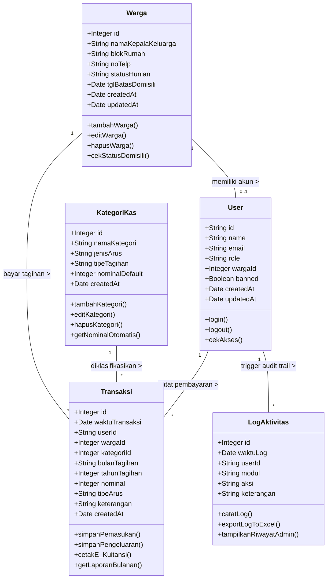

# Panduan Tercepat Generate Class Diagram di Draw.io

Cara tercepat untuk membuat *Class Diagram* lengkap di Draw.io tanpa perlu menggambar kotak dan menarik garis satu-per-satu secara manual adalah dengan menggunakan fitur **Text-to-Diagram (Mermaid)**.

## Langkah-Langkah (1 Menit Selesai):
1. Buka [app.diagrams.net (Draw.io)](https://app.diagrams.net/) di browser Anda.
2. Buat diagram baru (Blank Diagram).
3. Pada Menu Bar di bagian paling atas, klik menu **Arrange** > **Insert** > **Advanced** > **Mermaid...** (Atau Anda bisa klik tombol `+` (Plus) di *toolbar* > Advanced > Mermaid).
4. Sebuah kotak teks akan muncul. Hapus teks contoh yang ada di dalamnya.
5. **Copy** dan **Paste** seluruh blok kode Mermaid di bawah ini ke dalam kotak tersebut.
6. Klik tombol **Insert** (Warna biru).
7. Selesai! Draw.io akan otomatis merender struktur *Class Diagram* beserta seluruh atribut, *method*, dan relasi kardinalitas antar-tabelnya secara rapi!

---

## Kode Mermaid (Tinggal Copy-Paste)

> **Tips:** Setelah ter-generate di kanvas Draw.io, Anda bisa memindahkan posisi setiap kotak secara bebas dan garisnya akan tetap terhubung otomatis secara dinamis. Anda juga bisa mengganti warna (Style) dari masing-masing komponen class di menu palet sebelah kanan.
