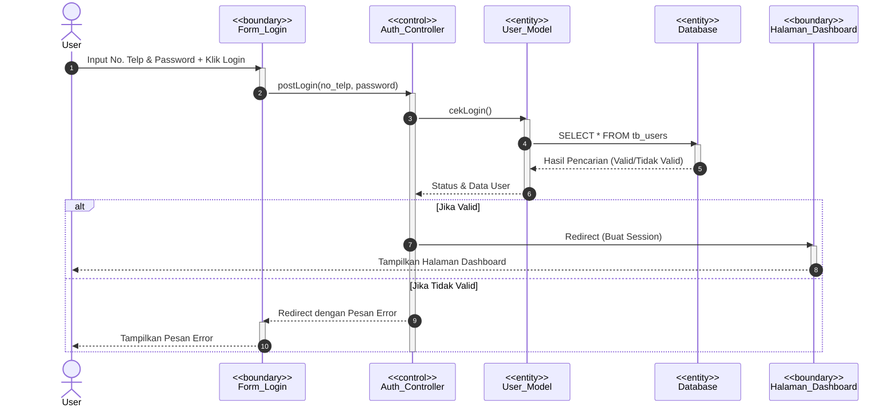
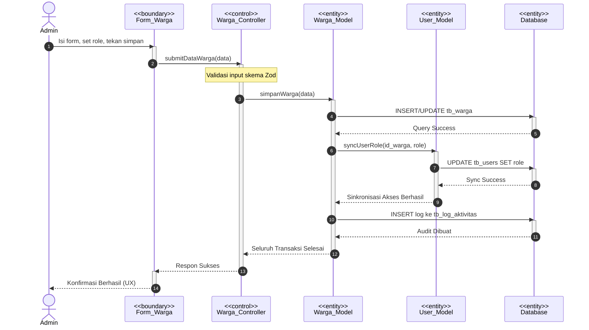
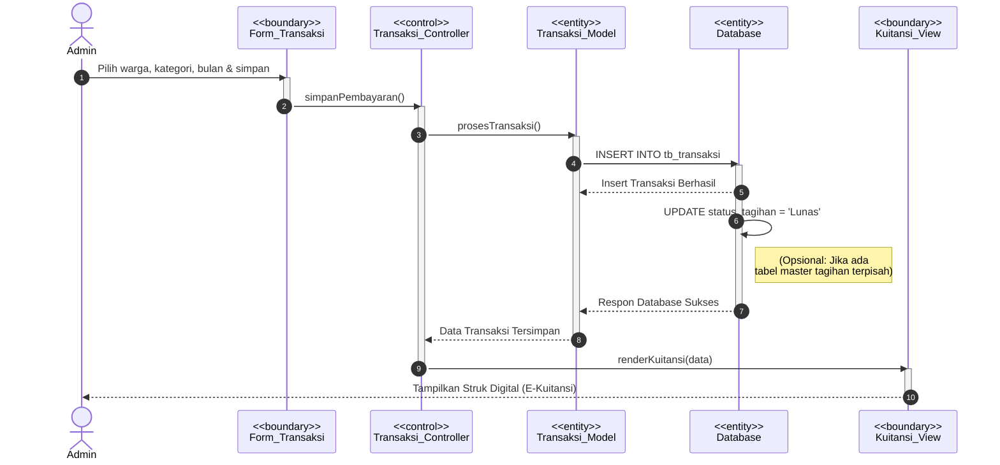

# Sequence Diagrams

Berikut adalah urutan Sequence Diagram menggunakan diagram Mermaid standar (*Boundary-Control-Entity* menggunakan label `<<stereotype>>` agar compatible dan siap *copy-paste* ke fasilitas Mermaid pada Draw.io).

---

## 1. Sequence Diagram: Proses Login
**Skenario:** Admin atau Warga masuk ke dalam sistem.

---

## 2. Sequence Diagram: Kelola Data Warga & Hak Akses Pengurus (Admin)
**Skenario:** Admin mendata warga baru/pengontrak, sekaligus menentukan akses Pengurus.

---

## 3. Sequence Diagram: Input Pembayaran Iuran (Kas Masuk)
**Skenario:** Admin mencatat warga yang membayar iuran bulanan.

